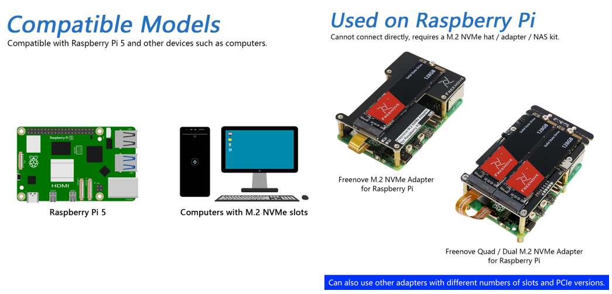
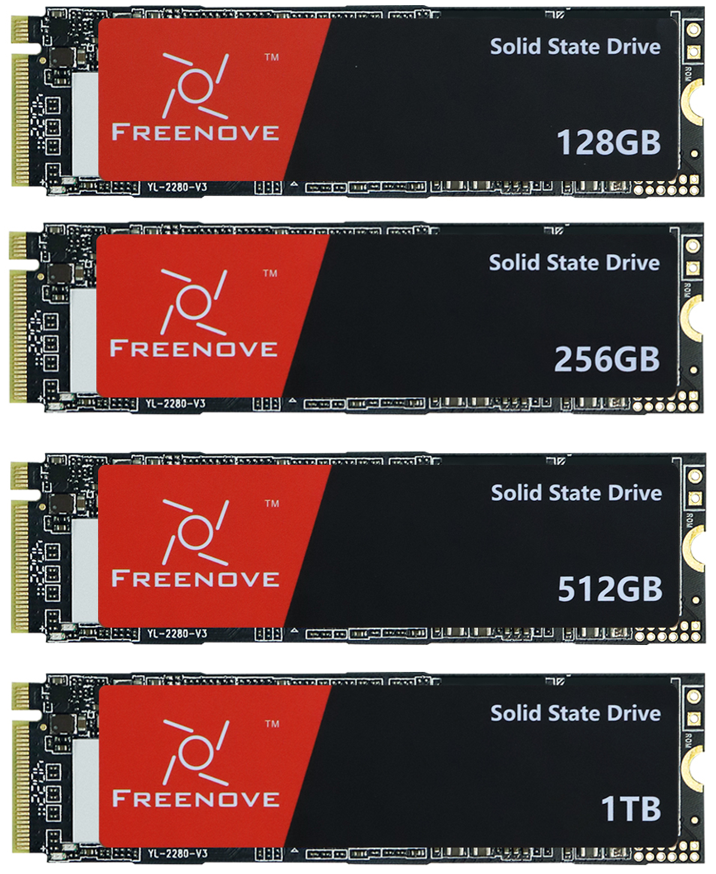

##############################################################################
Freenove M.2 NVMe SSD
##############################################################################

To accommodate diverse development needs, the FNK0106 series solid-state drives (SSD) offer multiple capacity options, including 128GB, 256GB, 512GB, and 1TB.

In embedded platforms like the Raspberry Pi, replacing traditional Micro SD cards with SSDs has proven to be an effective performance upgrade — delivering significantly faster read/write speeds, enhanced durability, and greater data reliability. Thanks to their superior I/O performance, these SSDs are also well-suited for NAS setups, ideal for use cases demanding rapid data access.

Platform Compatibility and Installation Guide
*****************************************************

Please note the installation requirements for this product across different platforms:

    * PC: This SSD can be directly installed on motherboards equipped with an M.2 NVMe interface.

    * Raspberry Pi: When used with a Raspberry Pi, it must be connected via an M.2 NVMe expansion board, adapter, or NAS expansion kit. 

      **Depending on your needs, you may select expansion hardware from our brand or other compatible third-party options.**

        - Single SSD solution: If you plan to use only one SSD, it is recommended to use our `FNK0098 series of adapter board <https://freenove.com/FNK0098>`_ (Freenove M.2 NVMe Adapter V2 for Raspberry Pi 5) or `FNK0100 series <https://freenove.com/FNK0100>`_ (Freenove Computer Case Kit for Raspberry Pi 5). 
          
          **These models support both PCIe 2.0 and 3.0 protocols, ensuring optimal performance of the drive.**
        
        - Multi-SSD Solution:If you need to deploy a multi-drive array, the `FNK0105 series <https://freenove.com/FNK0105>`_ (Freenove Quad / Dual M.2 NVMe Adapter for Raspberry Pi 5) are recommended. 
       
          **Please note that this series only support the PCIe 2.0 protocol.**

**If you have any concerns, please feel free to contact us via** support@freenove.com

Using on Raspberry Pi
*****************************************************

* For users who wish to use a single SSD as a regular drive or system drive, we recommend referring to the technical documentation for `FNK0098 <https://github.com/Freenove/Freenove_M.2_NVMe_Adapter_for_Raspberry_Pi>`_ and `FNK0100 <https://github.com/Freenove/Freenove_Computer_Case_Kit_for_Raspberry_Pi>`_.

* For users interested in building a NAS system with SSDs, we recommend consulting the technical documentation for `FNK0105 <https://github.com/Freenove/Freenove_Multi_M.2_NVMe_Adapter_for_Raspberry_Pi>`_ to obtain detailed guidance on multi-drive configuration and system setup.

SSD
*****************************************************

M.2 interface, NVMe protocol, PCle 2.0 or 3.0, size 2280

